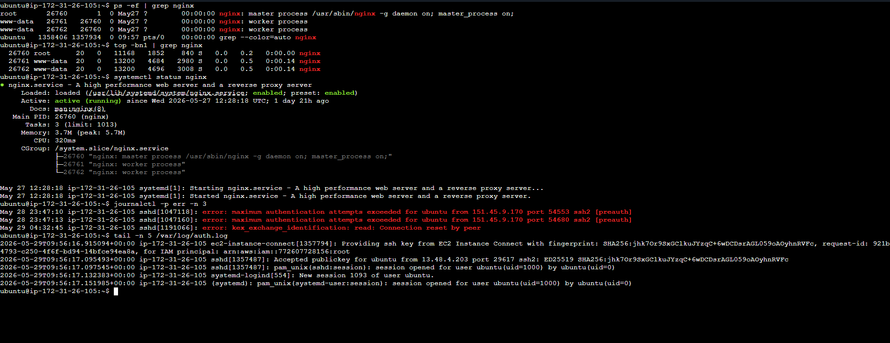

# Linux Practice: Processes and Services - Hands-on 

I executed the following commands to manage processes, services, and logs on my system:

Process Management:
- ps -ef: Lists every process with full-format listing including the UID and PPID.
- top -n 1 -b: Provides a one-time batch mode snapshot of system resource usage.

System Services:
- systemctl list-units --type=service --state=running: Displays all currently active services running on the host.
- systemctl status cron: Specifically inspected the cron daemon to ensure scheduled tasks are functional.

Logging and Troubleshooting:
- journalctl -p err -n 10: Fetches the last 10 system log entries with a priority of 'Error' or higher.
- tail -n 20 /var/log/auth.log: Checked the last 20 lines of the authentication log to monitor login attempts.

By running these commands, I can effectively monitor the health of the system and quickly identify any failing components or resource bottlenecks.

## Hands-on Screenshot

##  Basic Troubleshooting Flow
When a service isn't working as expected, I follow this standard flow to identify and fix the issue.

**Scenario:** A service (e.g., Nginx) is failing to start.

**Step 1: Check Status**
`systemctl status nginx` 
*Purpose: To see the immediate error message and exit code.*

**Step 2: Inspect Detailed Logs**
`journalctl -u nginx -n 50 --no-pager` 
*Purpose: To look for specific configuration errors or port conflicts in the last 50 lines of logs.*

**Step 3: Test Configuration (if applicable)**
`nginx -t` 
*Purpose: To verify there are no syntax errors in the config files.*

**Step 4: Restart and Verify**
`systemctl restart nginx && systemctl status nginx` 
*Purpose: To apply fixes and confirm the service is back online.*
