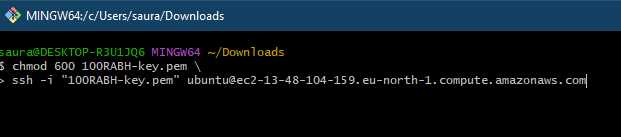
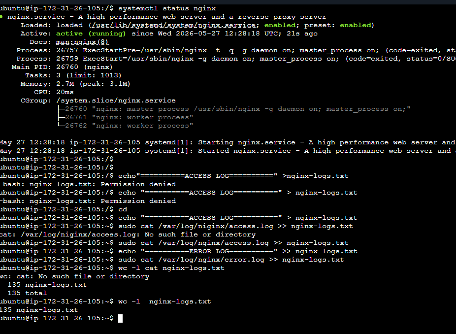
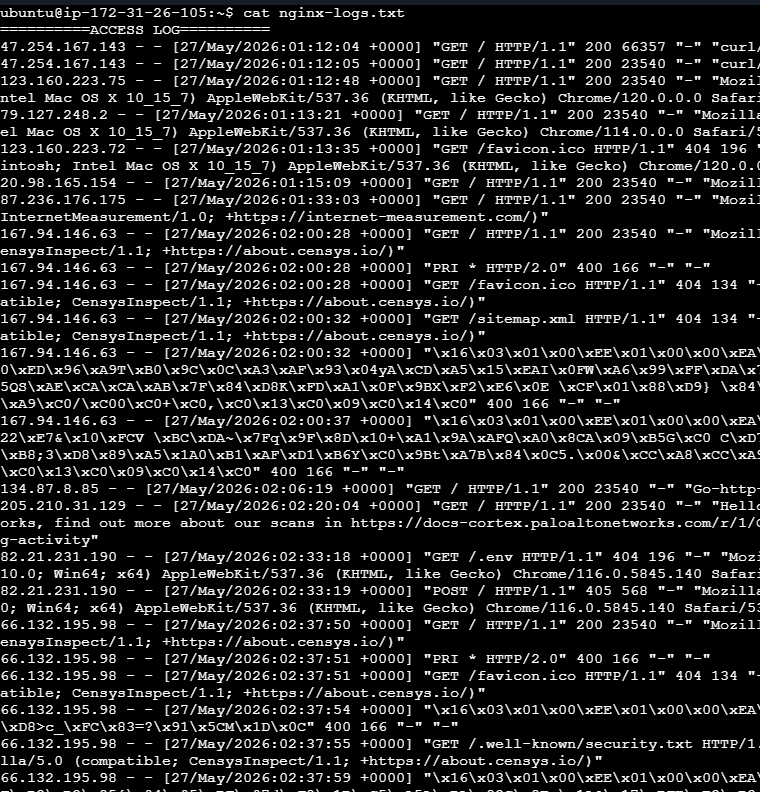

# GOAL : 
-  Launch a ec2 instance
-  SSH through bash
-  Start nginx
-  View the nginx on public ip  &&
-  Make text file for nginx logs.

## Used Commands Reference 
 
```bash
# change directory to locate
cd Downloads

# Fix key permissions
chmod 400 100RABH-key.pem
 
# Connect to instance
ssh -i "100RABH-key.pem" ubuntu@<PUBLIC-IP>
 
# start/check Nginx

sudo systemctl status nginx
 
# Save logs
echo "====== ACCESS LOG ======" > nginx-logs.txt
sudo cat /var/log/nginx/access.log >> nginx-logs.txt
echo "====== ERROR LOG ======" >> nginx-logs.txt
sudo cat /var/log/nginx/error.log >> nginx-logs.txt
 
# Copy logs to local machine
scp -i "day08-key.pem" ubuntu@<PUBLIC-IP>:~/nginx-logs.txt ./nginx-logs.txt
```
 
---

## SCREENSHOTS

> Screenshots: `SSH through bash`
 


- Command Syntax is wrong at above, i want to display both at once, so I put it . correct Syntax `&&` instead of `/`.
 
> Screenshot: `Status of Nginx`



> Screenshots: `Nginx running on public ip`


> Screenshot: `error and access log file into .txt files`

 
