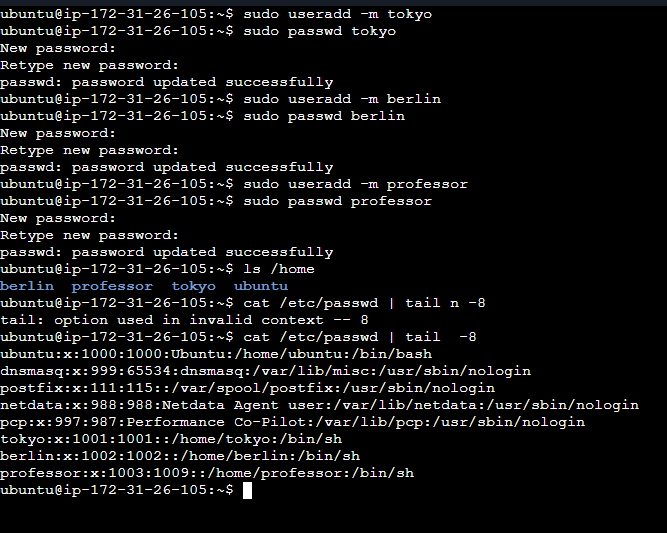
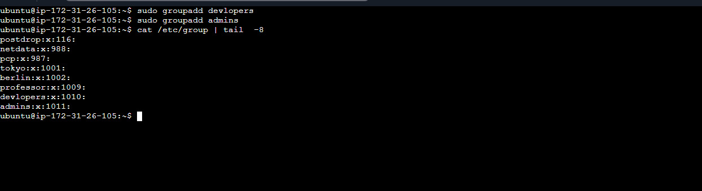
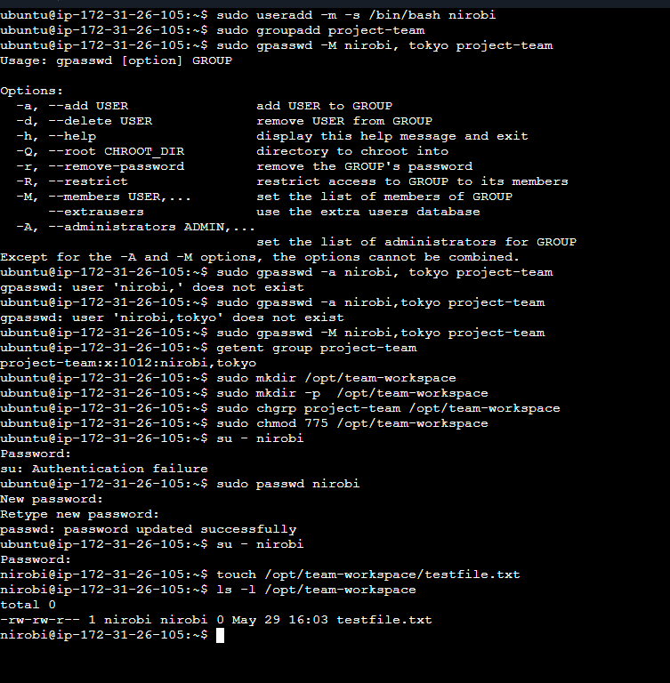

# User Management

### User created

### Group created

### Assign to groups

### Shared directory

### Created Team Workplace

## Overview
- Users  : `tokyo`, `berlin`, `professor`
- Groups : `admins`, `developers`, `project-team`
- Assign : *admins:* -> `professor & berlin` *developers:* -> `tokyo & berlin`                      
   *project-team:* -> `nibori & tokyo`
- Directory : `/opt/dev-project` , `opt/team-workspace`

## what i learned
>On Day 9 of my DevOps journey, I focused on Linux User and Group Management.
>I practiced creating multiple users such as tokyo, berlin, and professor.
>Organizing them into groups like admins and developers.
>How to manage directory permissions using chmod and chgrp
>Set up a collaborative team workspace at /opt/team-workspace
>Ensuring only specific group members have access.

  ### Understaninding.
  - Understand system security
  - How to manage access control in a multi-user environment.
  - How to create a collaborative team space
