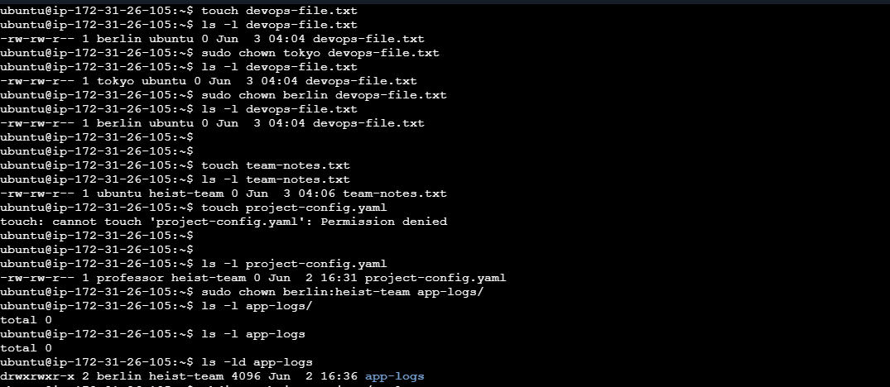
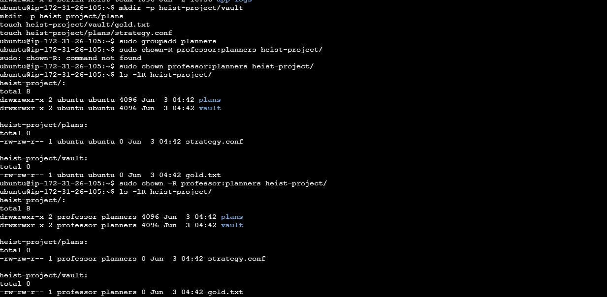
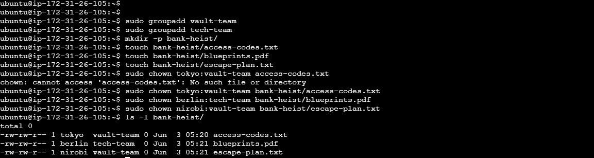

# DOCUMENTATION

## Task 1
*Based on Access control - diffrence*
- Owner (User): The owner is the individual user who created the file or directory, or who has been assigned ownership. 

- Group: A group is a collection of users who share the same set of permissions for a file or directory.

## Task `2-4`
- *basic chown, chgrp operation*
  
  

## Task 5
- *Recursive Ownership*
  
   

## Practice 
- *Operation - useradd,groupadd,chown*
  
  

### Command Used
```
# View ownership
ls -l filename

# Change owner only
sudo chown newowner filename

# Change group only
sudo chgrp newgroup filename

# Change both owner and group
sudo chown owner:group filename

# Recursive change (directories)
sudo chown -R owner:group directory/

# Change only group with chown
sudo chown :groupname filename

```

## What I Learned

- > Every file has a specific owner `user` and an associated group, which defines who has primary control and access.
- >The `chown` command is used to change user and group ownership,
  >while `chgrp` specifically updates the group ownership of a file.
- > `Proper ownership is vital for security,` 
  > ensuring only authorized users can modify sensitive files 
  >  while allowing teams to collaborate through group-level permissions.
