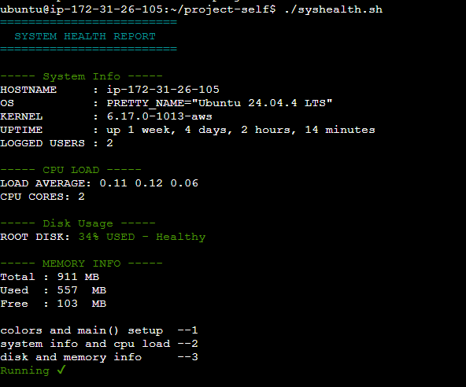

# DOCUMENTATION

### What I have learnt - *Detailed*

- first QnA
   -  3 Commands that save my time is : systemctl, journalctl & grep. there are most useful right now, in my progress
   -  Service healthy? by : systemctl status `services` and journalctl -ve -u `services`
   -  Change owner permission without breaking access - `sudo chown otheruser filename`
   -  `Plan for next 3 days - Mastering the networking concept & making project with the skills I learned till now.`

- Understanding
   - I know how to, `troubleshoot linux`, `Create cronjob`, `Create Bash Scripts` and little bit of knowledge of Networking
   - I `know the Concept of How the Networks work`, but lacking Hands-on
   - I `know Git fundamental` , but i `don't know Github Actions and labs`

### project 
- I am making a project where we can check system health , with the help of scripts and cronjob.
- i have some snippet

  

  
     
